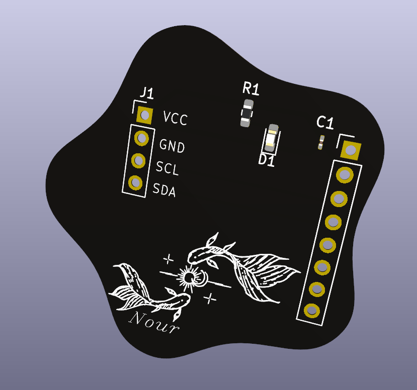
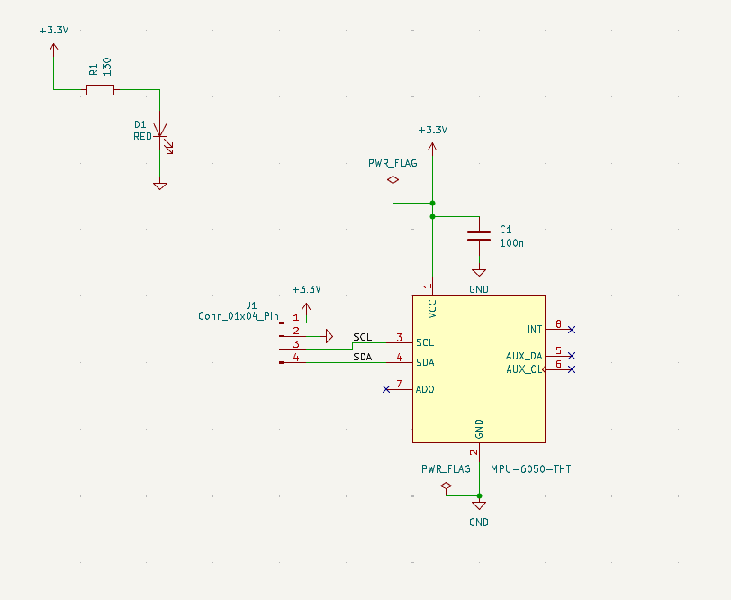
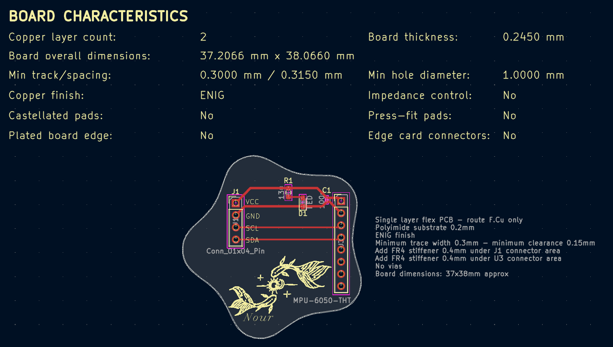

# MPU-6050 Flex PCB Breakout

A single-layer flexible PCB breakout board for the MPU-6050 6-axis IMU (GY-521 module), designed in KiCad and fabricated on a polyimide substrate at JLCPCB.



---

## Overview

This board breaks out the MPU-6050 GY-521 IMU module onto a custom flexible PCB, exposing VCC, GND, SCL, and SDA through a 4-pin header (J1) for easy integration with any I2C microcontroller.

The board features a custom star-shaped polyimide outline with koi fish silkscreen artwork, black coverlay, white silkscreen, and ENIG (gold) surface finish.

**Status: Boards ordered from JLCPCB — pending assembly and test.**

---

## Specifications

| Parameter | Value |
|---|---|
| Substrate | Polyimide flex (50µm dielectric) |
| Copper layers | 1 (F.Cu only) |
| PCB thickness | 0.12mm |
| Surface finish | ENIG (Immersion Gold, 1U") |
| Coverlay color | Black |
| Silkscreen | White |
| Cutting method | Laser cut (star profile) |
| Board dimensions | 37.21 × 38.07mm |
| Minimum trace width | 0.3mm |
| Minimum clearance | 0.15mm |
| Fabrication | JLCPCB |
| EDA tool | KiCad 7 |

---

## Schematic



### Components

| Reference | Component | Value | Package |
|---|---|---|---|
| U3 | MPU-6050 GY-521 module | — | PinHeader_1x08_2.54mm |
| J1 | I2C output connector | — | PinHeader_1x04_2.54mm |
| C1 | Decoupling capacitor | 100nF | 0603 SMD HandSolder |
| R1 | LED current-limiting resistor | 130Ω | 0603 SMD HandSolder |
| D1 | Status LED | Red | 0603 SMD HandSolder |

### Design Decisions

**Custom schematic symbol** — A custom MPU6050_GY521_Module symbol was created with pins numbered 1–8 to match the physical GY-521 header pinout, rather than using the bare chip symbol (24-pin QFN). This correctly represents the module-level interface and eliminates pin mapping errors.

**Single decoupling capacitor** — The GY-521 module consolidates VDD and VLOGIC internally into one VCC pin, so one 100nF ceramic cap is placed adjacent to the VCC header pin rather than two separate caps per chip pin.

**Through-hole header mounting** — The GY-521 module mounts via 2.54mm pitch through-hole headers, allowing the module to be swapped without reflowing SMD pads.

**130Ω LED resistor** — Calculated from VCC = 3.3V, V_LED = 2.0V (red), I_LED = 10mA: R = (3.3 - 2.0) / 0.010 = 130Ω.

---

## PCB Layout



### Layout Notes

- All routing on F.Cu — no vias, no B.Cu copper
- 45-degree trace bends throughout — no 90-degree corners per flex PCB design rules
- C1 placed within 2.5mm of U3 VCC pin for effective high-frequency decoupling
- R1 and D1 grouped within 2.5mm of each other
- Star-shaped board outline laser cut from polyimide substrate
- Koi fish artwork on F.Silkscreen — white ink on black coverlay

---

## Pinout

| J1 Pin | Signal | Description |
|---|---|---|
| 1 | VCC | 3.3V power input |
| 2 | GND | Ground |
| 3 | SCL | I2C clock — connect to GPIO 22 on ESP32 |
| 4 | SDA | I2C data — connect to GPIO 21 on ESP32 |

---

## Repository Structure

```
MPU6050-Flex-PCB/
├── hardware/
│   ├── MPU6050_Breakout.kicad_pro
│   ├── MPU6050_Breakout.kicad_sch
│   ├── MPU6050_Breakout.kicad_pcb
│   ├── schematic.png
│   ├── pcb_layout.png
│   └── board_render.png
├── MPU_GERBER/
│   └── (Gerber files)
└── README.md
```

---

## Author

**Nour Ammar** — Electrical Engineering
[LinkedIn](https://linkedin.com/in/nour-ammar-b8578026a) · [GitHub](https://github.com/Naaurrr)
